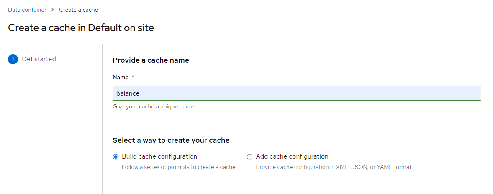
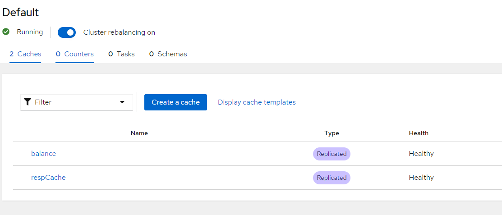
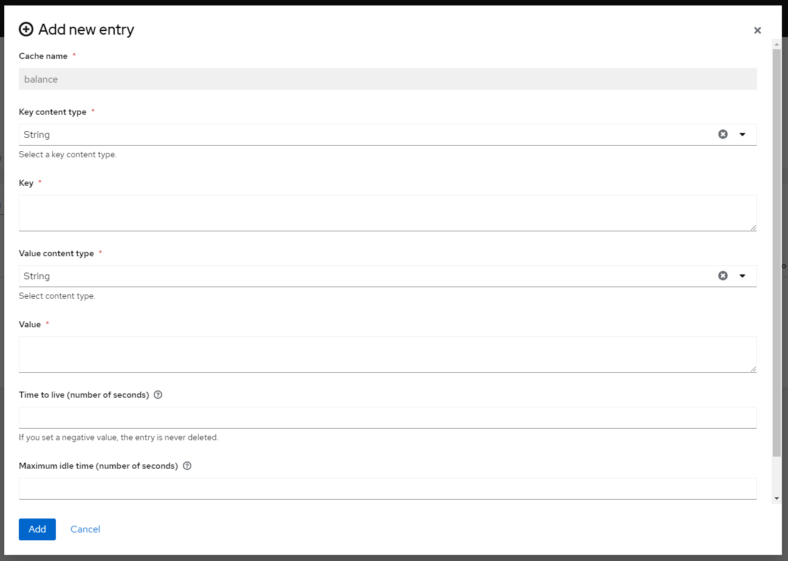

# Installation

Go to `infinispan.org` and go to download page. Select preferred version, and download.

## How to Install and Run

- extract downloaded `infinispan-server-14.0.31.Final.zip` 
- go to `bin` directory
- run this command `cli.sh user create admin -p password -g admin`, replace `sh` with `bat` if you are in a windows environment
- run `server.sh` to start `infinispan`

a successful `infinispan` would generate logs like below,
```
server.bat
2024-09-26 11:52:01,307 INFO  (main) [BOOT] JVM OpenJDK 64-Bit Server VM Red Hat, Inc. 17.0.6+10-LTS
2024-09-26 11:52:01,317 INFO  (main) [BOOT] JVM arguments = []
2024-09-26 11:52:01,319 INFO  (main) [BOOT] PID = 532
2024-09-26 11:52:01,348 INFO  (main) [org.infinispan.SERVER] ISPN080000: Infinispan Server 14.0.31.Final starting
2024-09-26 11:52:01,348 INFO  (main) [org.infinispan.SERVER] ISPN080017: Server configuration: infinispan.xml
2024-09-26 11:52:01,349 INFO  (main) [org.infinispan.SERVER] ISPN080032: Logging configuration: D:\software\infinispan-server-14.0.31.Final\server\conf\log4j2.xml
2024-09-26 11:52:01,929 INFO  (main) [org.infinispan.SERVER] ISPN080027: Loaded extension 'query-dsl-filter-converter-factory'
2024-09-26 11:52:01,930 INFO  (main) [org.infinispan.SERVER] ISPN080027: Loaded extension 'continuous-query-filter-converter-factory'
2024-09-26 11:52:01,932 INFO  (main) [org.infinispan.SERVER] ISPN080027: Loaded extension 'iteration-filter-converter-factory'
2024-09-26 11:52:01,934 WARN  (main) [org.infinispan.SERVER] ISPN080059: No script engines are available
2024-09-26 11:52:02,496 INFO  (main) [org.infinispan.CONTAINER] ISPN000556: Starting user marshaller 'org.infinispan.commons.marshall.ImmutableProtoStreamMarshaller'
2024-09-26 11:52:03,036 INFO  (main) [org.infinispan.CLUSTER] ISPN000078: Starting JGroups channel `cluster` with stack `tcp`
2024-09-26 11:52:03,039 INFO  (main) [org.jgroups.JChannel] local_addr: 0ae9e121-9464-4eeb-b27b-1ae18a6fa529, name: DESKTOP-8NNFTMF-6836
2024-09-26 11:52:03,081 INFO  (main) [org.jgroups.protocols.FD_SOCK2] server listening on *.57800
2024-09-26 11:52:05,090 INFO  (main) [org.jgroups.protocols.pbcast.GMS] DESKTOP-8NNFTMF-6836: no members discovered after 2006 ms: creating cluster as coordinator
2024-09-26 11:52:05,101 INFO  (main) [org.infinispan.CLUSTER] ISPN000094: Received new cluster view for channel cluster: [DESKTOP-8NNFTMF-6836|0] (1) [DESKTOP-8NNFTMF-6836]
2024-09-26 11:52:05,171 INFO  (main) [org.infinispan.CLUSTER] ISPN000079: Channel `cluster` local address is `DESKTOP-8NNFTMF-6836`, physical addresses are `[192.168.1.8:7800]`
2024-09-26 11:52:05,179 INFO  (main) [org.infinispan.CONTAINER] ISPN000389: Loaded global state, version=14.0.31.Final timestamp=2024-09-26T04:51:03.819284Z
2024-09-26 11:52:05,667 INFO  (main) [org.infinispan.CONTAINER] ISPN000104: Using EmbeddedTransactionManager
2024-09-26 11:52:05,866 INFO  (ForkJoinPool.commonPool-worker-2) [org.infinispan.server.core.telemetry.TelemetryServiceFactory] ISPN000953: OpenTelemetry tracing integration is disabled
2024-09-26 11:52:05,877 INFO  (main) [org.infinispan.SERVER] ISPN080018: Started connector Resp (internal)
2024-09-26 11:52:05,917 INFO  (ForkJoinPool.commonPool-worker-1) [org.infinispan.SERVER] ISPN080018: Started connector HotRod (internal)
2024-09-26 11:52:05,974 INFO  (ForkJoinPool.commonPool-worker-2) [org.infinispan.SERVER] ISPN080018: Started connector REST (internal)
2024-09-26 11:52:05,987 INFO  (main) [org.infinispan.SERVER] Using transport: NIO
2024-09-26 11:52:06,066 INFO  (main) [org.infinispan.SERVER] ISPN080004: Connector SinglePort (default) listening on 127.0.0.1:11222
2024-09-26 11:52:06,066 INFO  (main) [org.infinispan.SERVER] ISPN080034: Server 'DESKTOP-8NNFTMF-6836' listening on http://127.0.0.1:11222
2024-09-26 11:52:06,092 INFO  (main) [org.infinispan.SERVER] ISPN080001: Infinispan Server 14.0.31.Final started in 4742ms
```

## Opening Admin Dashboard

Go to `http://localhost:11222/` and login using credentials that are provided when creating a user.

## Creating a Cache Store

Press `Create a cache` button to create a new cache, 


We can later on select what type of caches we want to have, either `Distributed` or `Replicated`
- Distributed caches split entries into a fixed number of segments and assign each segment to a list of owner nodes. It means that a number of copies are maintained to provide redundancy and fault tolerance, however this is typically far fewer than the number of nodes in the cluster.
- Replicated caches do the same, with the exception that every node is an owner. It means that **all** nodes in a cluster hold all keys.

For this sample, we can select `Replicated` with `text/plain` encoding. Without any expiration date.

We can see the end result like this,


And we can start do some Cache operations after this
